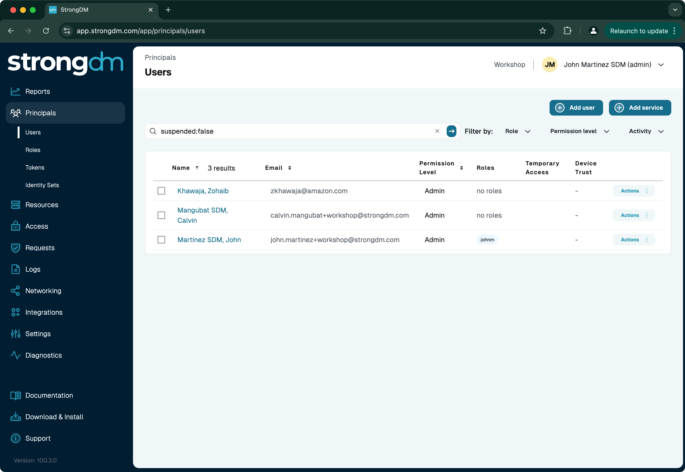
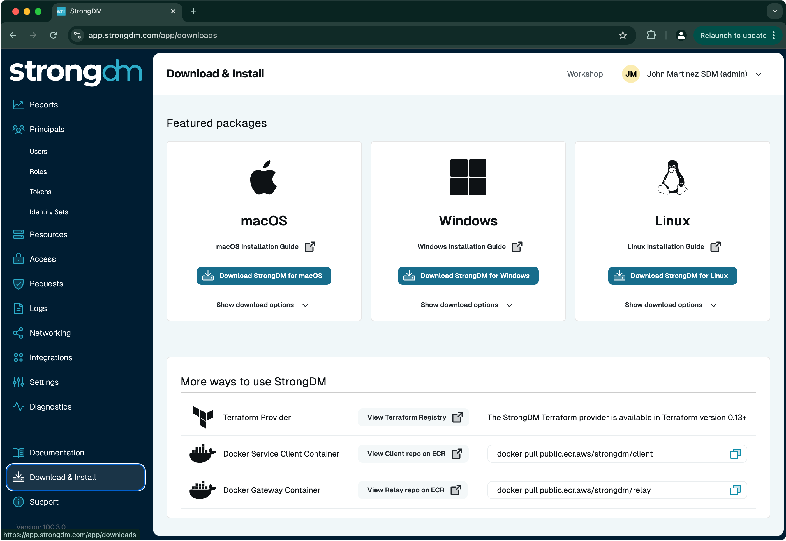
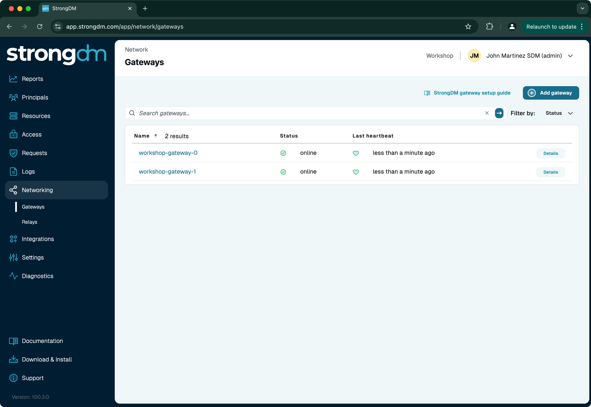
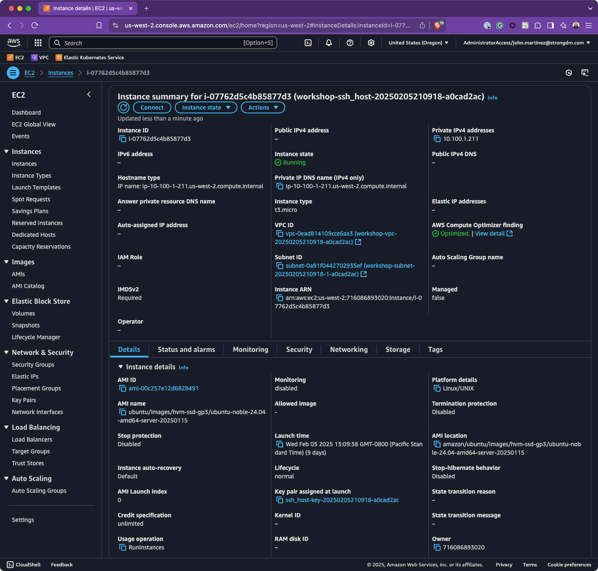
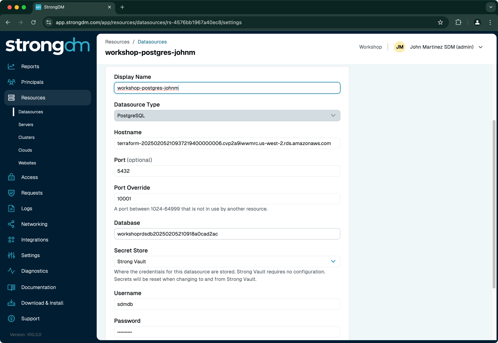
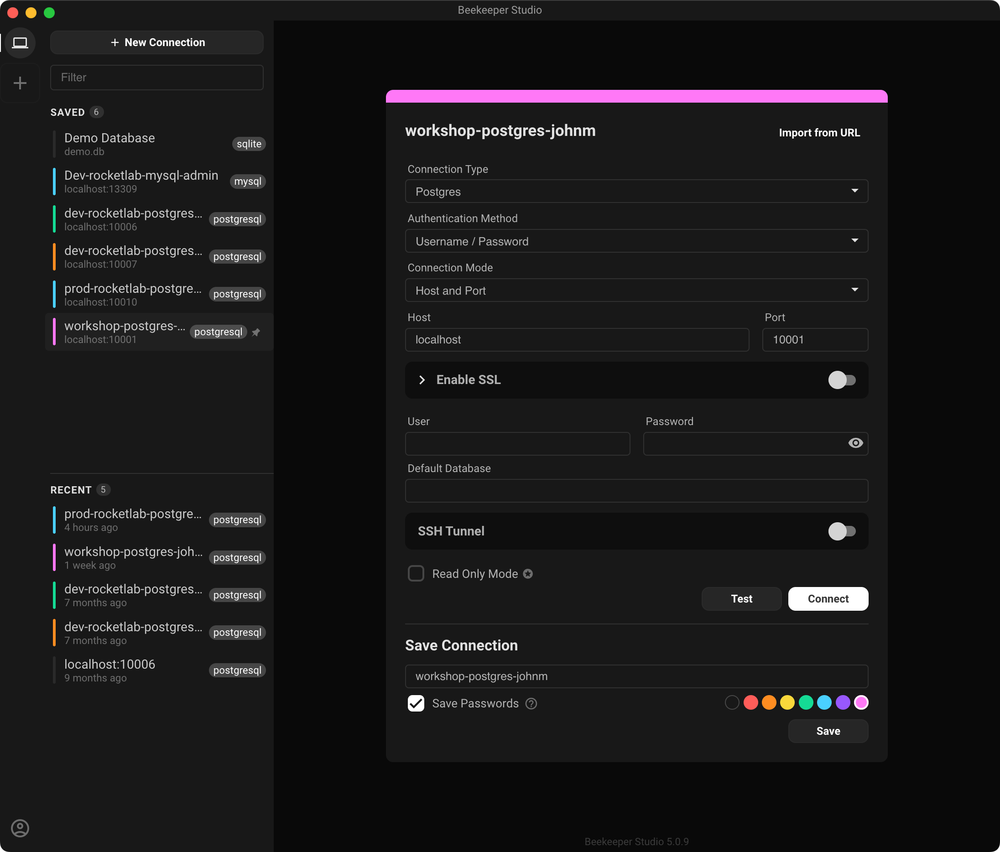
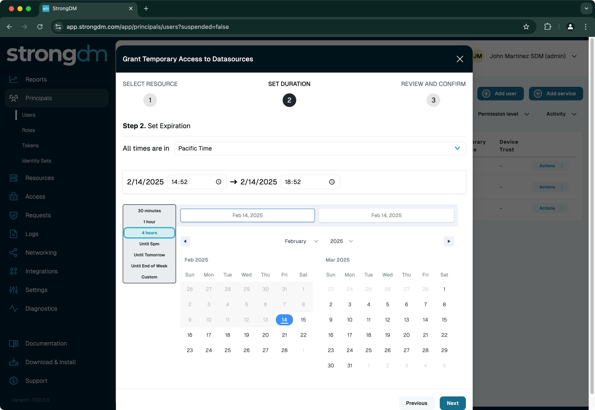
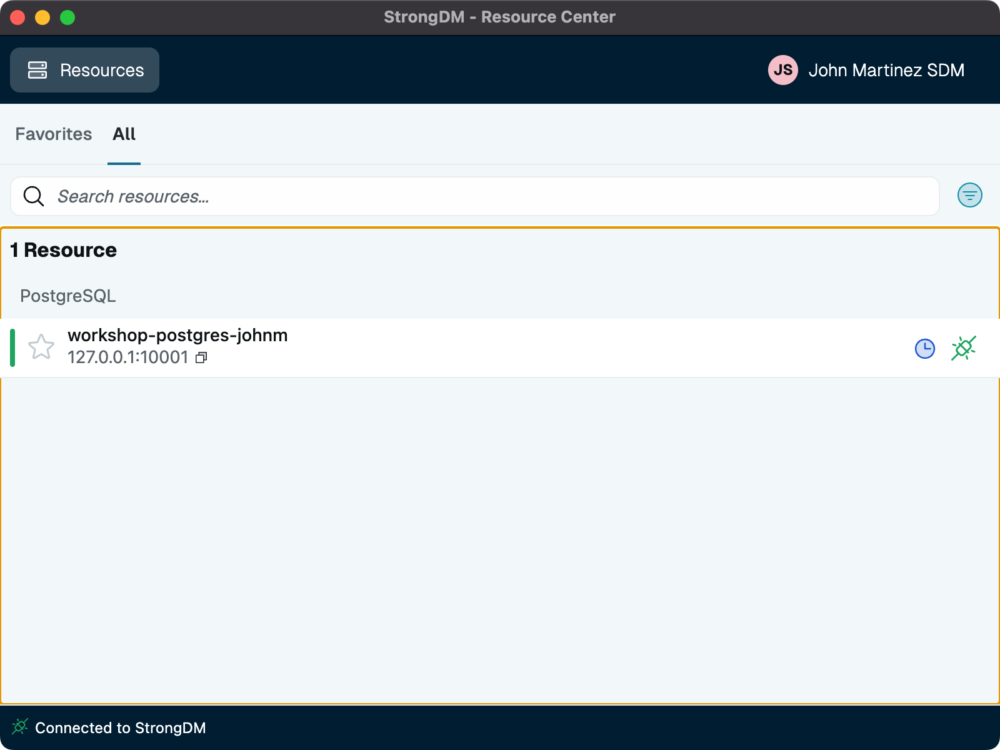

# Getting Started with StrongDM

## Requirements

1) **StrongDM Account**: You will receive a follow-up email from the StrongDM admin portal no less than 24 hours prior to the workshop, ensure that you sign in, set a password, and set up an MFA authenticator before the workshop.

2) **AWS Account**: You will log in to the AWS Cloud Management console, and you’ll receive an email prior to the workshop with link and instructions for setting up your access to the account. Ensure that you sign in, set a password, and set up an MFA authenticator before the workshop.

3) **BYOD**: You will need a macOS or Windows desktop environment from which you can access the Internet and install applications. If you have previously installed the StrongmDM Desktop app on that system, you will need to log out of your current credentials and use the StrongDM credentials that you will receive for the workshop.

4) **Desktop Tools**: Your desktop must be able to connect to SSH and PostgreSQL. Some people are comfortable with the CLI, so ssh and psql from a terminal or command window are good enough for them. For those who want a GUI, it’s perfectly fine to use PuTTY, Beekeeper Studio Community Edition, or DBeaver. (there are others, but those are the most common)

5) **Network Requirements**: Ensure that the network you are connecting from does not block connectivity to the StrongDM network. StrongDM requires connectivity to the internet on TCP port 5000. Corporate VPNs and networks sometimes block those egress ports. For testing purposes, you will also need to access TCP ports 22 (SSH) and 5432 (PostgreSQL) during the workshop. The reference architecture diagram shows exactly how network traffic flows from your desktop to StrongDM and AWS resources. In most cases, disabling or disconnecting from VPN, or joining a hotspot will fix connectivity issues.

6) **Bring Your Curiosity (and maybe a snack and a beverage to stay hydrated!)**:  Come with questions and an open mind—because in this workshop, there are no dumb questions, only unasked ones…and be ready to tinker! 

**NOTE**: The various resource and user names below will differ from what we work with in the Workshop
___

## Workshop Exercises

1) Access the StrongDM Admin UI portal and log in with your credentials.

   After you receive an invite from StrongDM, start by navigating to the [StrongDM Login Page](https://app.strongdm.com) and entering your credentials. You will be required to use a TOTP MFA app, such as Google Authenticator, to configure MFA. This MFA token will be used later in the workshop, as well.
   
   After logging in, you will be greeted with the StrongDM Admin UI, where you can manage resources, requests, and policies.

   Create a role that is unique to you, under Principals -> Roles, and assign the role to yourself be selecting "Actions" for your Username in Principals -> Users -> <Username> -> Actions -> Set Roles.

   

2) Download the StrongDM Desktop app

   On the bottom left, click on "Download & Install" and download the StrongDM Desktop app specific to your desktop client. macOS and Windows platforms have GUI and CLI apps, Linux is CLI only. Install the Desktop App and login with the same credentials as the Admin UI.

   

3) Using StrongDM Gateways

   StrongDM Gateways will already be installed in your AWS account, with the appropriate port (TCP/5000) configured in the EC2 Security Group. When creating resources in StrongDM, you will associate to these gateways.

   

4) Set up an EC2 Linux Instance

   Start an Ubuntu (recommended) or other Linux instance in the primary private VPC subnet in the AWS-provided AWS account. You will need the private key to store in Strong Vault when setting up the SSH resource under Resources -> Servers. Also, the EC2 seucity group must allow TCP port 22 from the StrongDM Gateway's EC2 Security Group. The SSH private key and port 22 will be used to configure the resource in StrongDM. Tag the instance with a `Name` tag that is unique to you.
   
   In the StrongDM Admin UI, to go Resources -> Servers, and click Add Server. Name the resource with a name unique to you, enter the private IP address or DNS name of your EC2 instance, the private SSH key, and 'ubuntu' under user name. Ensure that you create and enter a resource tag with a unique name to you. I recommend `env=<username>`.
   
   After setting up the resource, confirm that the resource status is "Healthy".

   
   

5) Set up an RDS PostgreSQL Database

   Start a new RDS PostgreSQL database. Similar to the EC2 Instance above, start the database in the private VPC subnet, You will need the database username and password that you set up for the database, the DB Identifier, and will use the default port 5432.
   
   In the StrongDM Admin UI, go to Resources -> Datasources. Click on "Add datasource", name the resource something unique to you, and choose "PostgreSQL" as the database type. Enter port 5432, the DB Identifier under "Database" and the Username and Password from the RDS Database. Ensure that you create and enter a resource tag with a unique name to you. I recommend `env=<username>`. After setting up the resource, confirm that the resource status is "Healthy".
   
   Download and install a SQL client of choice onto your desktop. Recommended is Beekeeper Studio Community Edition or DBEaver.

   
   

6) Grant Temporary Access the Resource

   Under Principals -> Users, click on Actions -> Grants Temporary Access, search for your resources, and grant yourself temporary access for the resources above. Set an expiratoin time of your choosing. Note that if you choose less than the time of the workshop, your session will be terminated and you will need to grant access again.
   
   Once granted, you will see the resources in the StrongDM Desktop app. Click on "Connect". Test connectivity to those resources using the clients of choice: SSH CLI or GUI client; SQL CLI or GUI client. When connecting, use `localhost` and the StrongDM dynamically generated port number. No username or password will be used.

   
   

7) [**OPTIONAL**]Create Policies

   In the StrongDM Admin UI, create policies that will allow access based contextual attributes (SSH and Postgres) and SQL actions (Postgres). Set up a policy that requires MFA (`@mfa` annotation) when connecting to a resource. The [StrongDM Policies documentation](https://www.strongdm.com/docs/admin/policies/) has syntax and attributes supported, the Policy Creator in the Admin UI has autocomplete hints, and the [Policy Playbooks page](https://www.strongdm.com/policies) has real-world examples you can experiment with.

8) Monitor activity with Policy Monitor.

   Use the Policy Monitor to view and evaluate user actions within StrongDM. It provides a detailed breakdown of allowed and denied actions, helping ensure compliance with security policies.

   

9) Explore logs for auditing and troubleshooting.

   StrongDM maintains detailed logs of all user actions, making it easy to audit and troubleshoot any issues. Access the logs section from the dashboard and filter results by user, resource, or action.

   

# Destroying the Configuration

You may manually revoke sessions and delete resources from the Admin UI and AWS Console, if you wish. We will destroy all resources and remove resources and users from the StrongDM Admin UI after the Workshop. We highly recommend you sign up for a free [StrongDM trial](https://www.strongdm.com/signup) after the workshop to continue using StrongDM.

---

# Additional Resources

- [StrongDM Documentation](https://www.strongdm.com/docs)
- [StrongDM Support](https://support.strongdm.com)

This walkthrough introduces key features of StrongDM and demonstrates its capabilities for simplifying and securing infrastructure access. Let us know if you have any questions or need further guidance during the workshop!
